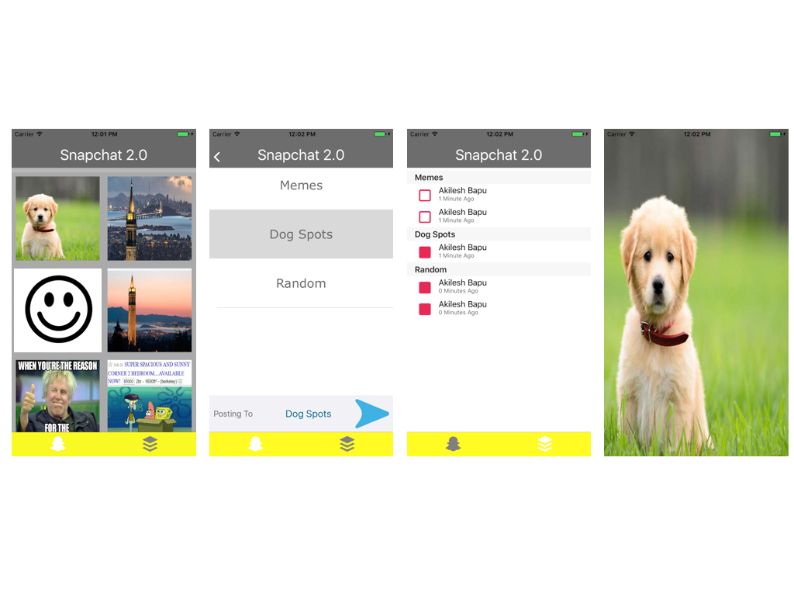

# HW3 Part 1: Snapchat Clone - the Feed #

## Due Date ##
Monday, October 22nd at 11:59pm

## Description ##
In this project, you will be making a Snapchat Clone! Users should be able to take a picture, post to a feed, and then be able to view all the posts in a feed in the "Snap" style of clicking on an image, viewing it, and not being able to see it again. Here are screenshots of our staff version of part 1. 

## Homework 3 Structure ##
You might be confused, we haven't taught you anything about using the camera or data storage, so how are you supposed to do this project?

We've abstracted it away into three parts:

* Part 1 (this part - due Monday, October 22nd) - We'll give you a placeholder for the camera which will let you pick from any of the 10 sample images. In addition, all the images will be stored locally, so anything you post will be private to you. You will use these pictures to create and test the feeds and general structure of the app
* Part 2 (due later) You'll connect your posts to a realtime cloud database (firebase)
* Part 3 (a lab) - You'll add a photo picker + camera to your app using AVFoundation

## Instructions ##
We've provided you with starter files but the only files you'll need to modify are:

* ImageFeed.swift - The local model for storing images, essentially adding them to a given array for a feed. 
* ImagePickerController.swift - Our placeholder for the camera you're going to implement in part 2.

**You will need to create more classes and files for this project.**

We've abstracted away the collection view and given you the method, which will get called everytime the user taps an image - Feel free to add any other methods or instance variables you may need:

	func selectImage(_ image: UIImage) {}

## Custom UI ##
Just like the hangman project, we haven't given any official requirements on how it should look. Our staff version is just one way you can do it. Any UI design that fulfills all the requirements is a valid UI and will be given full credit. More information on what icons can/can't be used in the Icon Guidelines.

## Requirements ##
You **must** include all features listed under the "Image Posting" and "Image Feed" sections and adhere to the "Image Asset Guidelines".

###  Image Posting ###
##### Screen Elements #####
* UITableView of feeds to post snaps to
* UIButton to press in order to make post to feed
* Status indicator that displays what feed you have selected to post to
* Some indicator that you have posted the snap

##### Flow #####
* User selects feed to post to (Cannot select multiple!)
* User sees the feed he's posting to and clicks the post button
* User is alerted that snap has been posted and is taken back to the image picker screen

### Image Feed ###
##### Screen Elements #####
* UITableView split into sections based on feed
* Each section should have a UITableViewCell with the poster's name, how long ago it was posted, and a status indicator image (read/unread)
* Tapping on a UITableViewCell should open the image full screen, don't worry too much about aspect ratio
* The image should just appear, there should be no animations

##### Flow #####
* User selects a snap to view by tapping on it
* The entire screen should only have the image on it
* Tapping the image should dismiss the image
* Image should be marked as read with the "read" image
* Image should not be viewable again

### Icon Guidelines ###
You may notice that there are several icons used in the demo screenshots for the status indicators, post buttons, and tab bar. All of these will be included in the assets folder and named as follows:

* read.png - Read status icon
* unread.png - Unread status icon
* goButton.png - Image for button that posts images
* post.png - Tab bar icon for all the posting views
* feed.png - Tab bar icon for all the feed views

The only ones you may change completely are the tab bar icons. Everything else must be the exact same image or an image that looks very similar.

### Optional Additions / Features ###
We will be giving you an already implemented staff solution to base your Part 3 off of so any optional additions/features would be more suited to that part of the project but feel free to experiment during this stage.

## Grading and Submission ##
There is no autograder for this project, so you will need to either create a private repository for your files and submit to using Github submission (recommended) or submit as a zip file to Gradescope.

# hw3: Snapchat Clone #
# part 2: Firebase (Due 11/5) #

## Overview ##
In this homework, you will be connecting your snapchat project to the Firebase Realtime Database. You will begin by creating a Firebase account and downloading CocoaPods, if you haven't done so already. Then you will connect your app to your very own customized Firebase console. You will then implement the login and signup pages for your users. After that, you will enable your app to store and retrieve data from your Firebase console. You might find reviewing the lecture on Firebase to be quite useful for this assignment.

## Getting Started ##
Download the starter code from this repository, as per usual. Then try running and launching the app on a simulator or an apple device. Play around and check out its current functionality. You will notice that when you click on the 'Login' or 'Signup' buttons, the app just directs you to the home page without doing any verification. In fact, you can successfully login or signup without putting any information at all! You will change this by the end of the homework. To get started, follow the following steps:
1. Go to Firebase here: https://firebase.google.com/ and click on 'SIGN IN'. Sign in with your google email account. Congratulations, if you did not have a Firebase account, now you do!
2. After this, it's time to get up close and personal with CocoaPods. CocoaPods is a dependency manager that helps you to import libraries in an elegant way. If you don't have CocoaPods already installed, run the following command on your Terminal: 'sudo gem install cocoapods'. After this is done, you will officially have CocoaPods installed on your computer! Now on to the big stuff.

## Part 1: Setting up your database ##
Now that you have a Firebase account and CocoaPods installed on your computer, it's time to get our hands dirty:
1. First, you'll need to create a unique Bundle Identifier for your app, in order to link it to Firebase. You can do this by editing your project (.xcodeproj) file in Xcode (click on "Snapchat Clone" in Xcode's Navigator). Set the "Bundle Identifier" to some unique string (typical format is reverse DNS notation *com.\<organization or name\>.\<product name\>* - i.e. *com.OskiBear.SnapchatClone*, but you can use any string you like). 
2. Go to your Firebase console with the account you created earlier and click on the 'Add Project' button. Give your project a pretty name or just stick with 'Snapchat Clone', this is up to you. Then click on 'Create Project'.
3. After the previous step, you should be re-directed to the Dashboard for your app. On the right tab of the dashboard, you should see three options, one for adding an iOS app, one for adding an android app and another for adding a web app. Choose the iOS option. From the pop-up window that follows, you will be asked for your iOS Bundle ID. Set this to the id you picked in step 1. 
4. From here on, just follow the instructions given to you by Firebase. Once your done, you should now have a Podfile and  xcworkspace file in your hw3-part2 folder. Close Xcode and open SnapchatClone.xcworkspace (we don't want to work with the .xcodeproj anymore).

### Log in ###

#### Installing pods
1. Go to your firebase console click on the 'Authentication' tab in the sidebar. 
2. Click 'SET UP SIGN-IN METHOD'. You will see that all sign-in methods are set to 'disabled'. Enable the 'Email/Password' option. You will not need the others for this homework.
3. Now we need to install a few pods to interact with Firebase. To do this, open your Podfile in any text editor, and add the following underneath the comment `# Pods for snapChatProject`

pod 'FirebaseAuth'
pod 'FirebaseStorage'
pod 'SDWebImage'
pod 'MBProgressHUD'
pod 'SDWebImage'
pod 'FirebaseDatabase'

4. To install and add these frameworks to your project, run `pod install` from terminal in the same folder as your Podfile.

#### Importing pods
In order to use these frameworks in your own classes, you'll need to import them. For example, to authenticate users using Firebase, we'll want to access methods and properties from "FirebaseAuth".

1. Open up LoginViewController and import the FirebaseAuth framework. Use UIKit as an example.

#### Authenticating Users

To save you some time, we've partially implemented the login process for you (we only did the easy part 😁) . Copy and paste the following code to the `logInPressed(_ sender: UIButton)` action, replacing the current code inside of it:

guard let emailText = emailTextField.text else { return }
guard let passwordText = passwordTextField.text else { return }

if emailText == "" || passwordText == "" {
//Alert to tell the user that there was an error because they didn't fill anything in the textfields
let alertController = UIAlertController(title: "Log In Error", message: "Please enter an email and password.", preferredStyle: .alert)
let defaultAction = UIAlertAction(title: "OK", style: .cancel, handler: nil)
alertController.addAction(defaultAction)
self.present(alertController, animated: true, completion: nil)
} 
else {
// email and password fields are not blank, let's try logging in the user!
// you'll need to use `emailText` and `passwordText`, and a method found in this
// api doc https://firebase.google.com/docs/auth/ios/start
// if the error == nil, segue to the main page using `performSegue` with identifier 
// `segueLogInToMainPage`
// if there is an error signing in (error != nil), present the following alert:

//    let alertController = UIAlertController(title: "Log In Error", message:
//                        error?.localizedDescription, preferredStyle: .alert)
//    let defaultAction = UIAlertAction(title: "OK", style: .cancel, handler: nil)
//    alertController.addAction(defaultAction)
//    self.present(alertController, animated: true, completion: nil)
}

**If you're lost on this step, look at the code provided in the Sign Up section. It's quite similar (in form! don't create a new user!) to what you'll want to be doing here.**

Nice job! You've now made sure that all the users are authenticated before they can use the app, no more anonymous users! (hopefully). Now, we all know that users hate having to put in their passwords every time they want to use an app (imagine if you had to remember the Facebook password every time you used it, yuk!). To ensure that this does not make us lose our few users, let's help them login automatically if they're already authenticated. Navigate to the `viewDidAppear`method in the class and finish implementing it according to the README.

### Sign Up ###
We can now authenticate users successfully, but we don't have any since we can't make them sign up yet! What a bummer. Worry not, this will be soon fixed. Now go to SignUpViewController.swift in the 'Authentication' folder. At the top of the class, import FirebaseAuth. Go to the class' `signUpPressed(_ sender: UIButton)` action and replace the `performSegue(withIdentifier: segueSignUpToMainPage, sender: self)` line with the following code and complete it according to the TODO:

guard let email = emailTextField.text else { return }
guard let password = passwordTextField.text else { return }
guard let name = nameTextField.text else { return }
guard let verifiedPassword = passwordVerificationTextField.text else { return }
if email == "" || password == "" || name == "" || verifiedPassword == "" {
let alertController = UIAlertController(title: "Form Error.", message: "Please fill in form completely.", preferredStyle: .alert)
let defaultAction = UIAlertAction(title: "OK", style: .cancel, handler: nil)
alertController.addAction(defaultAction)
present(alertController, animated: true, completion: nil)

} else {
Auth.auth().createUser(withEmail: email, password: password) { (user, error) in
if error == nil {
// TO DO:
// The user account has been successfully created. Now, update the user's name in
// firebase and then perform a segue to the main page. Note, again, that this segue
// already exists somewhere, just do some simple debugging to find the identifier.
// Also, notify the user that the account has been successfully created before
// performing the segue.

} else if password != verifiedPassword {
let alertController = UIAlertController(title: "Verification Error.", message: "The two passwords do not match.", preferredStyle: .alert)
let defaultAction = UIAlertAction(title: "OK", style: .cancel, handler: nil)
alertController.addAction(defaultAction)
self.passwordVerificationTextField.textColor = UIColor.red
self.present(alertController, animated: true, completion: nil)
} else {
let alertController = UIAlertController(title: "Sign Up Error", message: error?.localizedDescription, preferredStyle: .alert)
let defaultAction = UIAlertAction(title: "OK", style: .cancel, handler: nil)
alertController.addAction(defaultAction)
self.present(alertController, animated: true, completion: nil)
}
}
}

## Part 2: Storing Posts ##
Hooray!! We now have users signing up and logging into our app. Christmas came early this year. However, they can't store any of their posts to our database yet. Not for long. Go to your Firebase console and click on the 'Storage' option from the menu on your left. Click on 'GET STARTED'. This should get you ready to store your files. All the files that you post to Firebase will be stored in here. Now let us set up the database. Remember from lecture that the Firebase database returns all your data as a json file. You can get the data by casting it in a dictionary and getting the information you want. When you are done setting up the database, it will look something like this:

Open CurrentUser.swift in the 'Model' folder and import FirebaseDatabase and FirebaseAuth at the top. Then uncomment the lines that are beneath the first TODO for the class. After that, implement the next two functions according to the instructions in their TODOs. You're almost there!

Now switch to the ImageFeed.swift class in the same folder. At the top, import FirebaseDatabase and FirebaseStorage. This is the class that will actually enable us to store and retrieve our files to the storage and database. First off, uncomment the lines inside the `store(data: Data?, toPath path: String)` function and understand what it does. Then implement the `addPost(postImage: UIImage, thread: String, username: String)` function according to it's TODO. After that, go to the ChooseThreadViewController.swift class and import FirebaseAuth at the top. Uncomment the commented line in the `postToFeed(_ sender: UIButton)` function and understand what its doing.

You've done quite a lot of work for a homework, so the rest of the 'storing posts' part of it will be streamlined for you. Go to PostsTableViewController.swift in the Posts folder and import FirebaseDatabase, FirebaseStorage and MBProgressHUD. If you're getting the error that "No such module 'MBProgressHUD'" at this point, just ignore it. This might be the ghost of Xcode out to get you early for Halloween. Just uncomment the lines in the  `presentPostImage(forPost post: Post)` function as indicated. Make sure you read the comments throughout the other functions in the class and you understand what they are doing!

Bingo! Just like that, we can now store our posts to the database and the storage. Try posting something to your thread and check your database and storage. You will notice Firebase updating the posts in realtime. Cool ting, right?

## Part 3: Retrieving Posts ##
At this point, we can easily post our images and other information to our beautiful database and storage but we can't read from them! Dang, this Firebase thing is full of twists and turns. Don't worry though, we've got you covered! Go back to our ever so wonderful ImageFeed.swift file and implement the last part. Implement the `getPosts(user: CurrentUser, completion: @escaping ([Post]?) -> Void)` function according to it's README. If you need some help with the implementation, here is a slightly implemented solution:

let dbRef = Database.database().reference()
var postArray: [Post] = []
dbRef.child("Posts").observeSingleEvent(of: .value, with: { snapshot -> Void in
if snapshot.exists() {
if let posts = snapshot.value as? [String:AnyObject] {
user.getReadPostIDs(completion: { (ids) in
for postKey in posts.keys {
// COMPLETE THE CODE HERE
}
completion(postArray)
})
} else {
completion(nil)
}
} else {
completion(nil)
}
})

See how much easier that was with a little help? Again, you're welcome. Now, for the last part, just uncomment the lines in the `getDataFromPath(path: String, completion: @escaping (Data?) -> Void)` function.

Congratulations!! You've finally connected your app to your very own customized database. Wasn't that fun? This concludes this week's homework. Later in the class, you'll be replacing the static images with an embed camera, and instead pull from/post to a shared database so you can send snaps to fellow classmates.

## Submission
Submit to "hw4: Snapchat clone part 2" on Gradescope. We'll check that posts persist to your app between app sessions.

